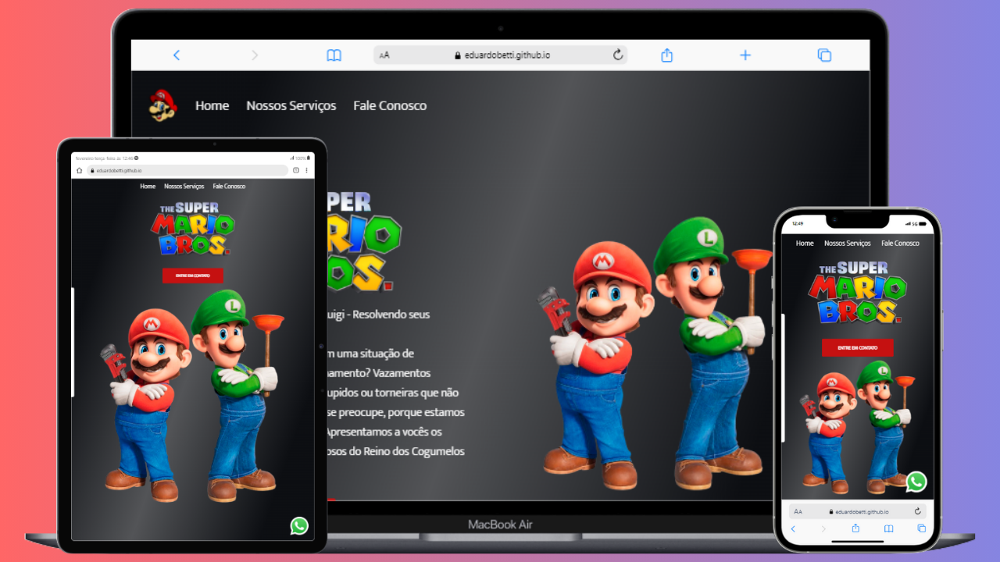

<h1>:mushroom: Encanadores Mario & Luigi :mushroom: </h1>
 

 

Projeto desenvolvido durante o módulo "R$ 1.000,00 em 07 dias", do Dev Club, sob a mentoria do professor Rodolfo Mori.

Neste projeto estão aplicadas as tecnologias HTML, CSS e JavaScript, além do conceito de responsividade.

Este é o segundo projeto que fiz upload no Github via terminal no VSCode, continuando o desafio proposto no módulo de Git & Github da Trilha Full Stack PRO do Dev Club.

 

<h2>Tecnologias utilizadas:</h2>

- 

- 

- 
 

<h2>Curiosidades:</h2>

Neste projeto aprendi a utilizar a função onclick(), que foi amplamente utilizada em alguns projetos posteriores.

Este foi o primeiro projeto que fiz após me tornar aluno do Dev Club.

